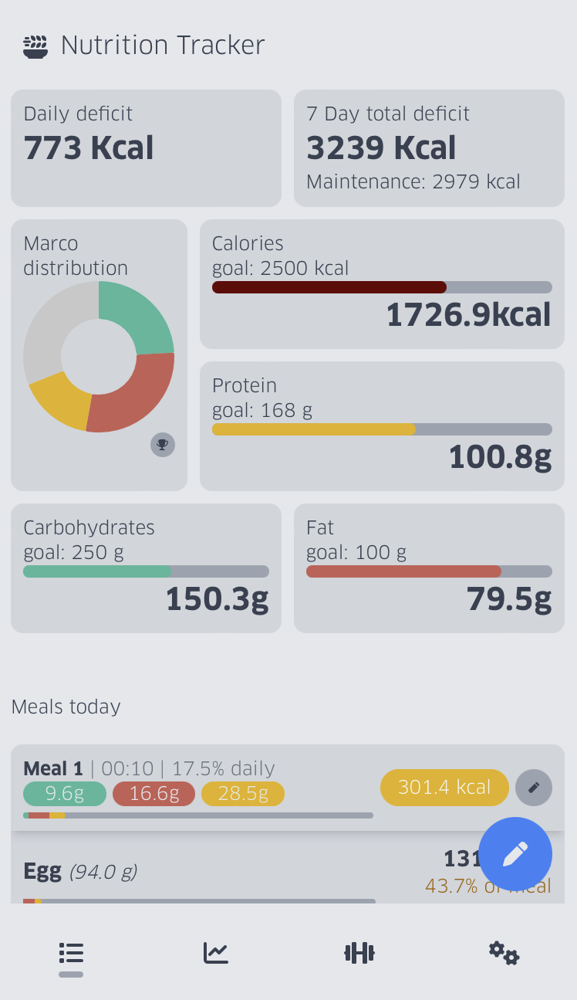

## TOP Nutrition App

Aka. Nutrition Tracker. Part of the Travis' Over-engineering Project (TOP).

This app initially aims to help you to track your marco intakes and visualize your consumption trend of the current month. However as I have been using this app to track my marcos, I gradually add more features to this app to help myself to gain more insight about my fitness life. Some of the features are:
  - 7 Day total deficit to give you an idea of how much weight you will lose (or gain) per week ()
  - Measurement tracking, such as your weight and waist size.
  - Maintenance calories calculation based on your age, height and physical activity level and the weight measurement you provide.
  - Target calories calculation per day based on your maintenance calories or simply a chosen number of your liking.
  - Workout tracking
  - Visualize workout trend, such as max weights and total volume
  - Workout type of each day visualized in a calendar view, such as push, leg and pull workouts.
  - ... and many more as long as I can think of and that I need them

### Screenshot

